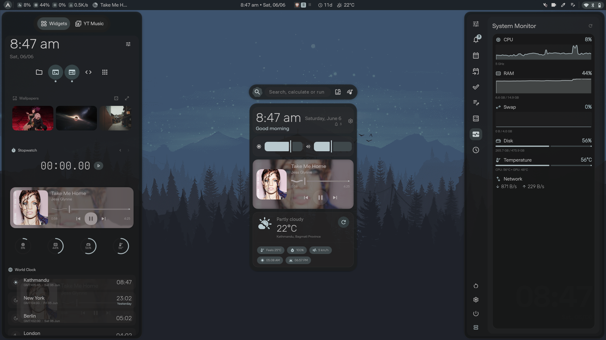

Personal Niri and Quickshell desktop configuration based on [end-4's dots-hyprland](https://github.com/end-4/dots-hyprland) and [iNiR](https://github.com/snowarch/iNiR), customized with personal preferences.

